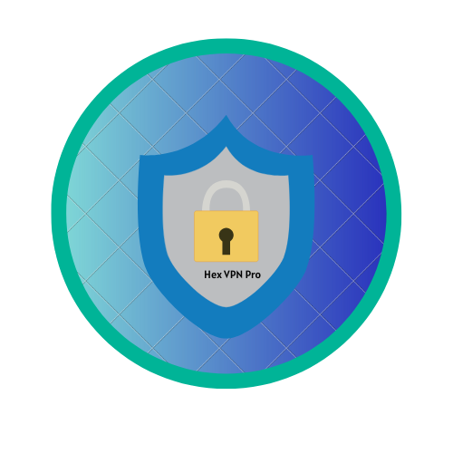
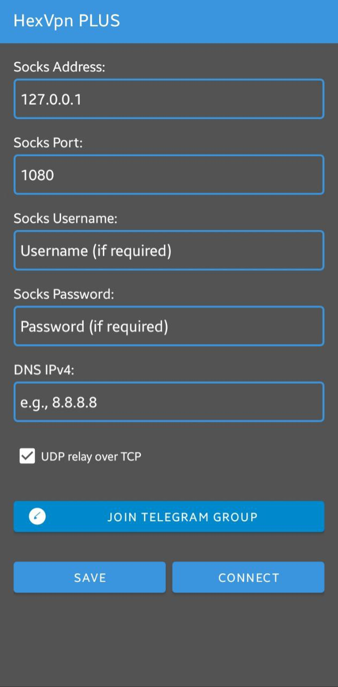

# 🚀 Hex VPN Plus

  

**Hex VPN Plus** is a fast and secure Android VPN app that connects you to the internet through any SOCKS5 proxy. It’s designed for users who want full control over their privacy, speed, and freedom.

---

## 📱 App Highlights

🔒 **Full SOCKS5 Proxy Support**  
Connect to your private SOCKS5 proxy with custom IP, Port, and credentials.

🚀 **Fast & Lightweight**  
Smooth performance with low battery usage.

🌐 **Unblock Websites & Apps**  
Bypass censorship and network restrictions anywhere.

🧠 **Clean, Simple UI**  
User-friendly interface with minimal steps to connect.

📡 **Uses Android VPNService**  
Routes your full internet traffic securely through proxy.

---

## 🖼 Screenshots

### 🔹 Home Screen  

  

---

## 🔄 App Updates

All new updates, version changes, and feature logs will be posted here in the repository under [Releases](https://github.com/yourusername/hex-vpn-plus/releases) or the **Changelog** section.

---

## 🔐 Privacy Policy

Read our [Privacy Policy](PRIVACY_POLICY.md) for more information about data handling.

---

## 📧 Contact

For support, feedback, or business inquiries:  
📬 `hexvai@proton.me`

---

> 🚫 **Disclaimer**  
> Hex VPN Plus does not provide or promote illegal proxy usage. Users must use their own proxies responsibly under local laws.

